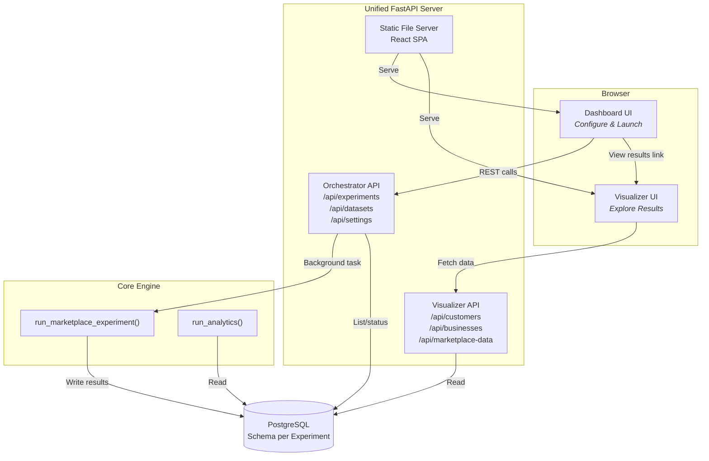

# Magentic Marketplace — Hosted Demo Edition [Vision to be implemented]

> 🍴 **This is a fork of [microsoft/multi-agent-marketplace](https://github.com/microsoft/multi-agent-marketplace)** with added web-based orchestration and a hosted deployment model for customer demos.

[](https://github.com/microsoft/multi-agent-marketplace)
[](https://arxiv.org/abs/2510.25779)

## What's Different in This Fork?

The original **Magentic Marketplace** is a Python framework for simulating AI-powered markets via CLI. This fork adds a **hosted web experience** so colleagues can run and explore marketplace simulations from their browser — no local setup required.

### New Features

- 🌐 **Web Dashboard** — Configure LLM models, pick datasets, and launch experiments from a browser UI
- 🔌 **Orchestrator REST API** — Programmatically trigger and monitor experiment runs (`POST /api/experiments`)
- 📊 **Integrated Visualizer** — Seamlessly transition from launching an experiment to exploring results
- 🏗️ **Single-Process Deployment** — Dashboard, API, and visualizer served from one FastAPI app, ready for Azure Container Apps

## Architecture




## CLI (Unchanged)

The original CLI still works exactly as before:

```bash
# Run via CLI
magentic-marketplace run data/mexican_3_9 --experiment-name my_exp

# Analyze
magentic-marketplace analyze my_exp

# Launch visualizer for a specific experiment
magentic-marketplace ui my_exp
```

## Cloud Deployment (Azure Container Apps) - planned

This fork is designed to run as a single container:

1. Build the Docker image
2. Deploy to Azure Container Apps with a PostgreSQL Flexible Server
3. Set API keys as Container App secrets
4. Share the URL with colleagues

> Bicep/IaC templates are not yet included — contributions welcome!

## What's Unchanged from Upstream

- ✅ Core marketplace simulation engine
- ✅ All agent logic (buyer/seller agents, protocols)
- ✅ CLI commands (`run`, `analyze`, `export`, `list`, `ui`, `audit`, `extract-traces`)
- ✅ Data generation scripts
- ✅ Existing visualizer UI functionality
- ✅ Python API (`run_marketplace_experiment()`, `run_analytics()`)

## Credits

This project is built on top of **[Magentic Marketplace](https://github.com/microsoft/multi-agent-marketplace)** by Microsoft Research. If you use this work, please cite the original paper:

```bibtex
@misc{bansal-arxiv-2025,
      title={Magentic Marketplace: An Open-Source Environment for Studying Agentic Markets},
      author={Gagan Bansal and Wenyue Hua and Zezhou Huang and Adam Fourney and Amanda Swearngin and Will Epperson and Tyler Payne and Jake M. Hofman and Brendan Lucier and Chinmay Singh and Markus Mobius and Akshay Nambi and Archana Yadav and Kevin Gao and David M. Rothschild and Aleksandrs Slivkins and Daniel G. Goldstein and Hussein Mozannar and Nicole Immorlica and Maya Murad and Matthew Vogel and Subbarao Kambhampati and Eric Horvitz and Saleema Amershi},
      year={2025},
      eprint={2510.25779},
      archivePrefix={arXiv},
      primaryClass={cs.MA},
      url={https://arxiv.org/abs/2510.25779},
}
```

## License

See the [upstream repository](https://github.com/microsoft/multi-agent-marketplace) for license details.
