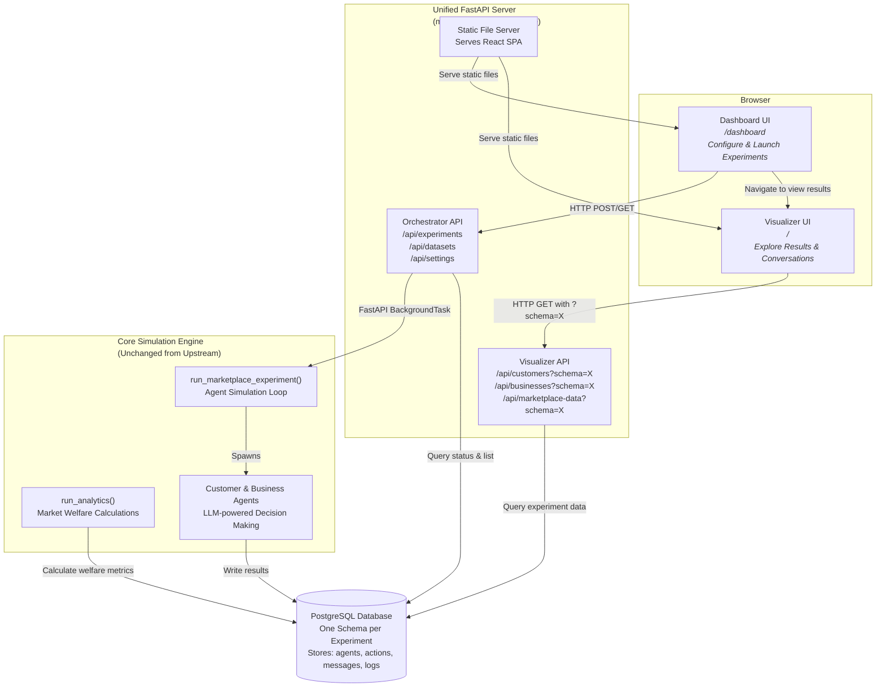

# Magentic Marketplace — Hosted Demo Edition

> 🍴 **This is a fork of [microsoft/multi-agent-marketplace](https://github.com/microsoft/multi-agent-marketplace)** with added web-based orchestration and a hosted deployment model for customer demos.

[](https://github.com/microsoft/multi-agent-marketplace)
[](https://arxiv.org/abs/2510.25779)

## Overview

**Magentic Marketplace** is a simulation environment for studying AI-powered agent-based markets. The original project from Microsoft Research provides a Python framework for simulating markets via CLI where autonomous AI agents (customers and businesses) interact through a defined protocol.

**This fork** extends the original with a **hosted web-based demo experience**, enabling users to configure, launch, and visualize marketplace experiments from a browser—without requiring local CLI setup. It's designed for easy deployment as a demo environment on cloud platforms like Azure Container Apps.

## What's Different in This Fork?

This fork adds a complete web-based orchestration layer on top of the original CLI-based framework:

### New Features ✨

- 🌐 **Web Dashboard** (`/dashboard`) — Browser-based UI to configure LLM settings, select datasets, and launch experiments with real-time status monitoring
- 🔌 **Orchestrator REST API** (`/api/*`) — Programmatically trigger and monitor experiment runs with endpoints for datasets, experiments, and system settings
- 📊 **Integrated Visualizer** — Seamlessly view experiment results directly from the dashboard, with enhanced navigation between launching and exploring
- 🏗️ **Unified Server** (`magentic-marketplace serve`) — Single FastAPI process that serves the dashboard UI, orchestrator API, visualizer UI, and visualizer API together
- 🐳 **Docker-Ready Deployment** — Designed for containerized deployment with PostgreSQL backend, ready for Azure Container Apps or similar platforms
- 🔄 **Dynamic Schema Support** — Visualizer API accepts experiment schema as a query parameter, eliminating need for server restarts when switching experiments

## Architecture

The fork maintains the original marketplace simulation engine while adding a web-based orchestration layer. Here's how the components work together:



**Key Architectural Points:**

- **Single Server Process**: All components (API, UI, visualizer) run in one FastAPI application for simplified deployment
- **Background Execution**: Experiments run asynchronously in background tasks, allowing the API to respond immediately
- **Schema-per-Experiment**: Each experiment creates its own PostgreSQL schema, enabling parallel experiment storage and querying
- **Dynamic Visualizer**: Visualizer API accepts schema as a query parameter, so you can view any experiment without restarting the server
- **Original Engine Intact**: The core marketplace simulation logic, agent behaviors, and LLM interactions remain unchanged from upstream

## Quick Start

### Prerequisites

- **Python 3.10+**: Required for the marketplace simulation engine
- **[uv](https://docs.astral.sh/uv/)**: Fast Python package manager (replaces pip/pip-tools)
- **[Docker](https://www.docker.com/get-started/)**: For running PostgreSQL database locally
- **Node.js 18+** (optional): Only needed if you want to modify the frontend React code

### Installation

1. **Clone this repository**

   ```bash
   git clone https://github.com/abeckDev/multi-agent-marketplace.git
   cd multi-agent-marketplace
   ```

2. **Install Python dependencies**

   ```bash
   uv sync --all-extras
   source .venv/bin/activate  # On Windows: .venv\Scripts\activate
   ```

3. **Configure environment variables**

   ```bash
   cp sample.env .env
   ```

   Edit `.env` to add your LLM API keys and model configuration:

   ```bash
   # Required: Choose your LLM provider
   LLM_PROVIDER=openai              # Options: openai, gemini, anthropic, azure_openai
   LLM_MODEL=gpt-4o                # Model name for your chosen provider
   
   # Required: Add API key for your provider
   OPENAI_API_KEY=sk-...           # If using OpenAI
   # ANTHROPIC_API_KEY=...          # If using Anthropic
   # GOOGLE_API_KEY=...             # If using Gemini
   
   # Optional: LLM behavior tuning
   LLM_TEMPERATURE=0.7
   LLM_MAX_TOKENS=4000
   LLM_MAX_CONCURRENCY=20          # Reduce to 10 if you hit rate limits
   
   # Database (defaults work with docker-compose)
   POSTGRES_PASSWORD=postgres
   POSTGRES_USER=postgres
   POSTGRES_DB=marketplace
   ```

4. **Start the PostgreSQL database**

   ```bash
   docker compose up -d
   ```

   This starts PostgreSQL on `localhost:5432` and pgAdmin on `localhost:8080`.

### Running the Unified Server (Recommended)

The unified server provides the complete web experience: dashboard, orchestrator API, and visualizer.

```bash
# Launch the unified server
magentic-marketplace serve --host 0.0.0.0 --port 8000

# With custom database settings
magentic-marketplace serve \
  --host 0.0.0.0 \
  --port 8000 \
  --postgres-host localhost \
  --postgres-port 5432 \
  --postgres-password postgres
```

Once running, open your browser to:

- **Dashboard**: [http://localhost:8000/dashboard](http://localhost:8000/dashboard) — Launch and monitor experiments
- **API Documentation**: [http://localhost:8000/docs](http://localhost:8000/docs) — Interactive Swagger UI for the API
- **Visualizer**: [http://localhost:8000/](http://localhost:8000/) — View experiment results (navigate from dashboard)

### Running Experiments via CLI (Original Method)

All original CLI commands still work exactly as before:

```bash
# Run an experiment using the CLI
magentic-marketplace run data/mexican_3_9 --experiment-name my_first_experiment

# View results with the visualizer UI
magentic-marketplace ui my_first_experiment

# Analyze market outcomes
magentic-marketplace analyze my_first_experiment

# List all experiments
magentic-marketplace list

# Export to SQLite for sharing
magentic-marketplace export my_first_experiment
```

## API Endpoints

### Orchestrator API

The orchestrator API enables programmatic control of experiments.

#### `GET /api/datasets`

List all available datasets with metadata (business count, customer count, path).

**Example Response:**
```json
[
  {
    "name": "mexican_3_9",
    "path": "/path/to/data/mexican_3_9",
    "num_businesses": 9,
    "num_customers": 3
  }
]
```

#### `GET /api/settings`

Get current system defaults and available configuration options.

**Example Response:**
```json
{
  "default_search_algorithm": "simple",
  "default_search_bandwidth": 10,
  "default_postgres_host": "localhost",
  "default_postgres_port": 5432,
  "available_providers": ["openai", "gemini", "anthropic", "azure_openai"]
}
```

#### `POST /api/experiments`

Create and launch a new experiment in the background.

**Request Body:**
```json
{
  "dataset": "mexican_3_9",
  "experiment_name": "my_experiment",
  "search_algorithm": "simple",
  "search_bandwidth": 10,
  "customer_max_steps": null,
  "postgres_host": "localhost",
  "postgres_port": 5432,
  "postgres_password": "postgres",
  "override": false
}
```

**Response:**
```json
{
  "name": "my_experiment",
  "status": "pending",
  "started_at": null,
  "completed_at": null,
  "error": null
}
```

Status values: `pending` → `running` → `completed` or `failed`

#### `GET /api/experiments/{name}/status`

Check the real-time status of a specific experiment.

**Example Response:**
```json
{
  "name": "my_experiment",
  "status": "running",
  "started_at": "2024-02-18T14:30:00Z",
  "completed_at": null,
  "error": null
}
```

#### `GET /api/experiments`

List all experiments stored in PostgreSQL with metadata.

**Query Parameters:**
- `limit` (optional): Maximum number of experiments to return
- `host`, `port`, `database`, `user`, `password` (optional): Database connection overrides

**Example Response:**
```json
[
  {
    "schema_name": "my_experiment",
    "first_activity": "2024-02-18T14:30:00Z",
    "last_activity": "2024-02-18T14:45:00Z",
    "agents_count": 12,
    "actions_count": 145,
    "logs_count": 420,
    "llm_providers": ["openai"]
  }
]
```

#### `GET /health`

Health check endpoint for monitoring.

### Visualizer API

The visualizer API provides read access to experiment results for the web UI. All endpoints require the `schema` query parameter to specify which experiment to query.

#### `GET /api/customers?schema={experiment_name}`

Get all customer agents and their profiles for a specific experiment.

**Example Response:**
```json
[
  {
    "id": "customer_0001",
    "name": "Customer 1",
    "request": "I want to buy authentic Mexican food...",
    "menu_features": [...],
    "amenity_features": [...]
  }
]
```

#### `GET /api/businesses?schema={experiment_name}`

Get all business agents and their profiles for a specific experiment.

**Example Response:**
```json
[
  {
    "id": "business_0001",
    "name": "Taco Palace",
    "menu": [...],
    "amenities": [...]
  }
]
```

#### `GET /api/marketplace-data?schema={experiment_name}`

Get complete marketplace activity including messages, conversations, and analytics.

**Example Response:**
```json
{
  "messages": [...],
  "threads": [...],
  "analytics": {
    "total_customers": 3,
    "total_businesses": 9,
    "customer_utility": {...},
    "business_profit": {...}
  }
}
```

## Development Workflow

### Frontend Development

The dashboard and visualizer are built with React, TypeScript, and Vite.

1. **Install frontend dependencies** (first time only):

   ```bash
   cd packages/marketplace-visualizer
   npm install
   ```

2. **Build the frontend** (for production use):

   ```bash
   npm run build
   ```

   This creates optimized static files that the unified server will serve.

3. **Run frontend in dev mode** (with hot reload):

   ```bash
   # Terminal 1: Start the backend
   cd /path/to/multi-agent-marketplace
   magentic-marketplace serve

   # Terminal 2: Start the Vite dev server
   cd packages/marketplace-visualizer
   npm run dev
   ```

   The Vite dev server (default: http://localhost:5173) will proxy API calls to the backend server. You can override the backend URL with `VITE_API_TARGET` in `.env.development`.

4. **Code quality checks**:

   ```bash
   npm run type-check  # TypeScript type checking
   npm run lint        # ESLint
   npm run format      # Prettier
   npm run fix         # Auto-fix lint and format issues
   npm run check       # Run all checks (type, lint, format)
   ```

### Python Development

The core marketplace engine and API are written in Python 3.10+.

1. **Install in editable mode**:

   ```bash
   uv sync --all-extras
   source .venv/bin/activate
   ```

2. **Run tests** (if available):

   ```bash
   pytest
   ```

3. **Code formatting**:

   The project uses standard Python tooling. Check `pyproject.toml` for configured tools.

### Project Structure

```
multi-agent-marketplace/
├── packages/
│   ├── magentic-marketplace/          # Core Python package
│   │   └── src/magentic_marketplace/
│   │       ├── api/                   # Orchestrator API (FastAPI)
│   │       ├── marketplace/           # Core simulation engine
│   │       │   ├── agents/            # Customer & Business agents
│   │       │   ├── actions/           # Marketplace protocol actions
│   │       │   └── llm/               # LLM client integrations
│   │       ├── platform/              # Server & database layer
│   │       ├── experiments/           # CLI commands & analytics
│   │       ├── ui/                    # Visualizer server logic
│   │       ├── unified_server.py      # Unified FastAPI app (NEW)
│   │       └── cli.py                 # CLI entry point
│   └── marketplace-visualizer/        # React frontend (NEW)
│       ├── src/
│       │   ├── pages/
│       │   │   ├── Dashboard.tsx      # Experiment launcher UI
│       │   │   └── Visualizer.tsx     # Results viewer UI
│       │   ├── services/              # API client code
│       │   └── App.tsx                # React Router setup
│       └── package.json
├── data/                              # Sample datasets
├── experiments/                       # Research experiment scripts
└── docs/                             # VitePress documentation
```

## Deployment

### Docker Deployment (Recommended)

This fork is designed for containerized deployment with all components in a single container.

**Example Dockerfile:**

```dockerfile
# Multi-stage build for efficient image
FROM node:18-alpine AS frontend-build
WORKDIR /app/frontend
COPY packages/marketplace-visualizer/package*.json ./
RUN npm ci
COPY packages/marketplace-visualizer/ ./
RUN npm run build

FROM python:3.11-slim
WORKDIR /app

# Install uv for faster Python dependency management
COPY --from=ghcr.io/astral-sh/uv:latest /uv /usr/local/bin/uv

# Copy Python package
COPY packages/magentic-marketplace/ ./magentic-marketplace/
RUN cd magentic-marketplace && uv pip install --system -e .

# Copy built frontend from stage 1
COPY --from=frontend-build /app/frontend/dist ./magentic-marketplace/src/magentic_marketplace/ui/dist

# Set environment variables
ENV PYTHONUNBUFFERED=1
ENV HOST=0.0.0.0
ENV PORT=8000

# Expose port
EXPOSE 8000

# Run unified server
CMD ["magentic-marketplace", "serve", "--host", "0.0.0.0", "--port", "8000"]
```

**Build and run:**

```bash
docker build -t magentic-marketplace .
docker run -p 8000:8000 \
  -e OPENAI_API_KEY=$OPENAI_API_KEY \
  -e LLM_PROVIDER=openai \
  -e LLM_MODEL=gpt-4o \
  -e POSTGRES_HOST=your-db-host \
  -e POSTGRES_PASSWORD=your-db-password \
  magentic-marketplace
```

### Azure Container Apps

The unified server is ideal for Azure Container Apps deployment:

1. **Create Azure resources**:

   ```bash
   # Create resource group
   az group create --name magentic-rg --location eastus

   # Create PostgreSQL Flexible Server
   az postgres flexible-server create \
     --resource-group magentic-rg \
     --name magentic-db \
     --admin-user adminuser \
     --admin-password <strong-password> \
     --sku-name Standard_D2s_v3 \
     --tier GeneralPurpose \
     --storage-size 32

   # Create Container Apps environment
   az containerapp env create \
     --name magentic-env \
     --resource-group magentic-rg \
     --location eastus
   ```

2. **Deploy the container**:

   ```bash
   az containerapp create \
     --name magentic-marketplace \
     --resource-group magentic-rg \
     --environment magentic-env \
     --image your-registry.azurecr.io/magentic-marketplace:latest \
     --target-port 8000 \
     --ingress external \
     --env-vars \
       OPENAI_API_KEY=secretref:openai-key \
       LLM_PROVIDER=openai \
       LLM_MODEL=gpt-4o \
       POSTGRES_HOST=magentic-db.postgres.database.azure.com \
       POSTGRES_USER=adminuser \
       POSTGRES_PASSWORD=secretref:db-password
   ```

3. **Configure secrets**:

   ```bash
   az containerapp secret set \
     --name magentic-marketplace \
     --resource-group magentic-rg \
     --secrets \
       openai-key=<your-openai-key> \
       db-password=<your-db-password>
   ```

> **Note**: This repository does not include Bicep/Terraform IaC templates yet. Contributions welcome!

### Environment Variables

Configure these environment variables for deployment:

**Required:**
- `LLM_PROVIDER` — LLM provider: `openai`, `gemini`, `anthropic`, or `azure_openai`
- `LLM_MODEL` — Model name (e.g., `gpt-4o`, `gemini-1.5-pro`)
- `OPENAI_API_KEY`, `ANTHROPIC_API_KEY`, or `GOOGLE_API_KEY` — API key for your chosen provider
- `POSTGRES_HOST` — PostgreSQL hostname
- `POSTGRES_PASSWORD` — PostgreSQL password

**Optional:**
- `POSTGRES_PORT` — Database port (default: 5432)
- `POSTGRES_USER` — Database user (default: postgres)
- `POSTGRES_DB` — Database name (default: marketplace)
- `LLM_TEMPERATURE` — Response randomness (default: 0.7)
- `LLM_MAX_TOKENS` — Max tokens per response (default: 4000)
- `LLM_MAX_CONCURRENCY` — Max concurrent LLM calls (default: 20)
- `HOST` — Server bind address (default: 0.0.0.0)
- `PORT` — Server port (default: 8000)

## What's Unchanged from Upstream

The core marketplace simulation engine remains **fully intact** and compatible with the original project:

✅ **Core Marketplace Engine**
- All marketplace protocol actions (Search, SendMessage, FetchMessages, etc.)
- Agent decision-making logic and LLM integration
- Customer and Business agent implementations
- Market dynamics and interaction patterns

✅ **CLI Commands**
- `magentic-marketplace run` — Run experiments via CLI
- `magentic-marketplace analyze` — Compute market welfare metrics
- `magentic-marketplace export` — Export to SQLite
- `magentic-marketplace list` — List all experiments
- `magentic-marketplace ui` — Launch standalone visualizer
- `magentic-marketplace audit` — Audit LLM usage
- `magentic-marketplace extract-traces` — Extract agent traces

✅ **Python API**
- `run_marketplace_experiment()` — Programmatic experiment execution
- `run_analytics()` — Programmatic analytics calculation
- All marketplace classes and utilities

✅ **Data & Experiments**
- Dataset format (YAML files in `businesses/` and `customers/` directories)
- All included datasets (`mexican_3_9`, `mexican_10_30`, etc.)
- Research experiment scripts in `experiments/` directory
- Data generation scripts

✅ **Database Schema**
- PostgreSQL schema structure
- Tables: agents, actions, logs, messages
- SQLite export format

✅ **Original Visualizer UI**
- The standalone visualizer UI (`magentic-marketplace ui`) works exactly as before
- All conversation views, agent profiles, and analytics displays

**What This Means**: You can use this fork as a drop-in replacement for the upstream project. All existing scripts, notebooks, and workflows that use the CLI or Python API will continue to work without modification.

## Available Datasets

The repository includes several pre-configured datasets for experimentation:

| Dataset | Customers | Businesses | Description |
|---------|-----------|------------|-------------|
| `mexican_3_9` | 3 | 9 | Small-scale Mexican restaurant marketplace |
| `mexican_10_30` | 10 | 30 | Medium-scale Mexican restaurant marketplace |
| `mexican_33_99` | 33 | 99 | Large-scale Mexican restaurant marketplace |
| `mexican_100_300` | 100 | 300 | Extra-large marketplace for scale testing |
| `contractors` | Multiple | Multiple | Contractor services marketplace |
| `media_markt` | Multiple | 16 | Electronics retail with dual business types |

Each dataset directory contains:
- `businesses/` — YAML files with business profiles (menu, amenities, pricing)
- `customers/` — YAML files with customer preferences and requirements
- `baseline_utilities.json` — Ground truth utility values for welfare calculations
- `README.md` — Dataset-specific documentation

See the [data/](data/) directory for full details.

## Troubleshooting

### Rate Limiting Errors

If you encounter rate limiting from your LLM provider:

```bash
# Reduce concurrent requests in .env
LLM_MAX_CONCURRENCY=10  # Default is 20
```

Setting `LLM_MAX_CONCURRENCY=1` forces sequential execution.

### Database Connection Errors

**"Too many connections"**: Reduce the connection pool size in your experiment configuration or increase `POSTGRES_MAX_CONNECTIONS` in docker-compose.

**"Database does not exist"**: Ensure PostgreSQL is running:

```bash
docker compose ps
docker compose up -d  # If not running
```

### Frontend Build Issues

If the unified server can't find the frontend files:

```bash
cd packages/marketplace-visualizer
npm install
npm run build
```

The build output should be in `packages/marketplace-visualizer/dist/`.

### Experiment Not Showing in Visualizer

The visualizer requires the experiment schema to be passed as a query parameter:

```
http://localhost:8000/?schema=my_experiment_name
```

Or navigate from the dashboard's "View" button, which handles this automatically.

## Contributing

This fork welcomes contributions! Areas of interest:

- Infrastructure-as-Code templates (Bicep, Terraform) for Azure deployment
- Docker Compose setup with frontend build
- Additional LLM provider integrations
- UI/UX improvements for dashboard and visualizer
- Documentation improvements

Please follow the contribution guidelines from the [upstream project](https://github.com/microsoft/multi-agent-marketplace).

## Credits & Citation

This project builds upon **Magentic Marketplace** from Microsoft Research. The core simulation engine, agent implementations, marketplace protocol, and research foundations are from the original project.

**Upstream Repository**: [microsoft/multi-agent-marketplace](https://github.com/microsoft/multi-agent-marketplace)

**Research Paper**: If you use this work in research, please cite the original paper:

```bibtex
@misc{bansal-arxiv-2025,
      title={Magentic Marketplace: An Open-Source Environment for Studying Agentic Markets},
      author={Gagan Bansal and Wenyue Hua and Zezhou Huang and Adam Fourney and Amanda Swearngin and Will Epperson and Tyler Payne and Jake M. Hofman and Brendan Lucier and Chinmay Singh and Markus Mobius and Akshay Nambi and Archana Yadav and Kevin Gao and David M. Rothschild and Aleksandrs Slivkins and Daniel G. Goldstein and Hussein Mozannar and Nicole Immorlica and Maya Murad and Matthew Vogel and Subbarao Kambhampati and Eric Horvitz and Saleema Amershi},
      year={2025},
      eprint={2510.25779},
      archivePrefix={arXiv},
      primaryClass={cs.MA},
      url={https://arxiv.org/abs/2510.25779},
}
```

**Paper Abstract**: *"Magentic Marketplace: An Open-Source Environment for Studying Agentic Markets"* — This paper introduces a simulation environment for studying AI-powered agent-based markets, enabling research into market dynamics, agent behaviors, and potential risks in automated marketplaces.

**Additional Resources**:
- 📄 [Read the paper on arXiv](https://arxiv.org/abs/2510.25779)
- 💻 [Upstream GitHub repository](https://github.com/microsoft/multi-agent-marketplace)
- 📚 [Official documentation](https://github.com/microsoft/multi-agent-marketplace/tree/main/docs)

**Fork Maintainer**: [abeckDev](https://github.com/abeckDev)

## License

This project inherits its license from the upstream repository. See the [upstream LICENSE](https://github.com/microsoft/multi-agent-marketplace/blob/main/LICENSE) for details.

---

**Questions or Issues?** Please open an issue on this repository or consult the [upstream documentation](https://github.com/microsoft/multi-agent-marketplace).

